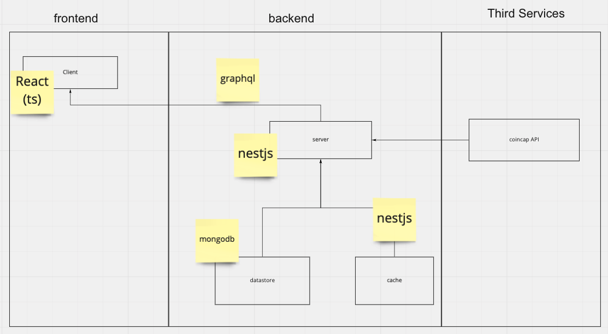
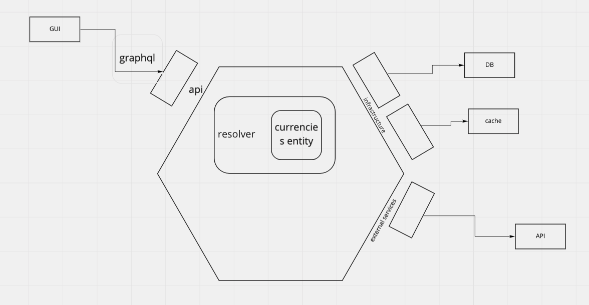
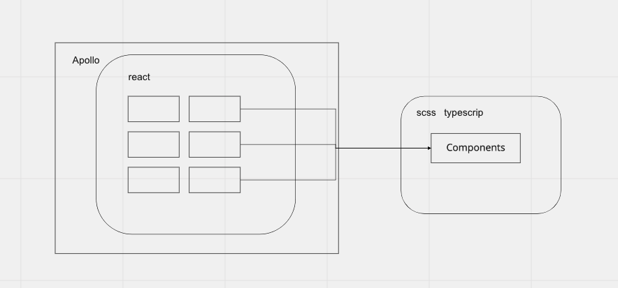

<p style="background: white" align="center">
  <a href="http://mar1n.com" target="blank" ></a>
</p>

<p align="center">implementation of DDD (domain driven design) and CDD (component driven design) in a simple app for forecast of cryptocurrencies</p>

## Motivation

we find many article to what is an architecture and also what is the clean code, the onion architecture or hexagonal architecture. Some people understand by reading but I understand when I making ( you understand what I try ti say 😁)

in this repo, I will try to reproduce an DDD (backend side) and CDD( frontend side) with the following stack: Typescript everywhere.



## Engineering

Before I start coding I choose to spend more time thinking about the architecture, how I could implement it in a small project, the best way is by painting a diagram.

you can see my brainstorm here [miro](https://miro.com/app/board/o9J_llP5RqU=/?invite_link_id=828246920801)

In essence, this application is cut off somewhere, the application logic is inside the domain folder and the interaction with other external elements is another folder depending on the type of interaction, you can see everything in the following image.



all things behind if for the backend side, for the frontend side:



**this repository has a list of commands in the root for both applications (frontend and backend)**

## Installation

```bash
# All in one
$ npm run install
```

## Running the app

```bash
# All in one
$ npm init
# Only backend
$ cd /server & npm start
#or in root
$ npm run server:start
# Only frontend
$ cd /frontend & npm start
#or in root
$ npm run frontend:start
```

## Test

```bash
# All in one
$ npm run test
# Only frontend
$ cd /frontend & npm test
#or in root
$ npm run frontend:test
# Only backend
$ cd /server & npm test
#or in root
$ npm run server:test

```

## Other command

```bash
# development
$ cd /server & npm start

# watch mode backend
$ cd /server & npm start:dev

# production mode
$ cd /server & npm run start:prod
```

## To improve

In this adventure I have found some problems and characteristics that I cannot do for reasons of time.

-   subscription graphql implementation
-   storybook implementation (problems with jest)
-   creation of stories
-   DB implementation to save data on the server
-   design improvement
-   chart implementation for each curency
-   implementation of behavior chart of the first 3 currency
-   data comparison between 2 currency
-   data comparison between 2 currency chart
-   implementation of persistence test

-   External library test implementation in case it doesn't work, what data do I send to the frontend?
